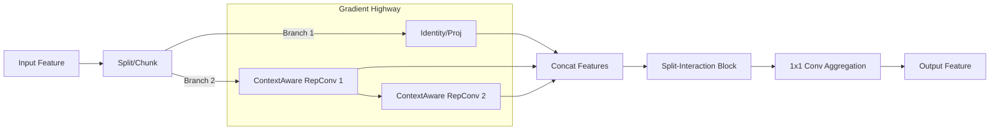

# Review of Advanced Modules for Small Object Detection and Proposal for SC-ELAN

## 1. Abstract
This review analyzes three state-of-the-art modules—**Pzconv**, **FCM (Feature Context Module)**, and **RepNCSPELAN4**—that have demonstrated significant improvements in small object detection compared to YOLOv8 benchmarks. By identifying their common advantages in multi-scale context perception, feature interaction, and gradient flow efficiency, we propose a novel hybrid module: **SC-ELAN (Spatial-Context Efficient Layer Aggregation Network)**.

## 2. Analysis of Existing Modules

### 2.1 Pzconv (Parallel Zone Convolution)
*   **Mechanism**: utilizes parallel convolution kernels of varying sizes (3x3, 5x5, 7x7) to extract features.
*   **Advantage for SOD**: Addresses the lack of texture information in small objects by expanding the receptive field. The larger kernels capture surrounding context (e.g., "sky" around a "bird"), which is crucial for distinguishing objects from background noise.

### 2.2 FCM (Feature Context Module)
*   **Mechanism**: A dual-branch structure that splits channels and uses one branch to generate spatial/channel attention weights for the other.
*   **Advantage for SOD**: Provides a self-calibration mechanism. Small objects are often overwhelmed by background clutter; FCM's cross-attention highlights the relevant spatial locations and feature channels, effectively suppressing false positives.

### 2.3 RepNCSPELAN4 (Generalized ELAN)
*   **Mechanism**: Dense layer aggregation with gradient path optimization, often combined with re-parameterization.
*   **Advantage for SOD**: Solves the "gradient vanishing" problem common in deep networks. By aggregating features from different depths (concatenation), it preserves high-resolution shallow features (edges, corners) that are vital for detecting tiny targets, ensuring they aren't lost during downsampling.

## 3. Common Advantages Summary
The success of these modules in small object detection can be attributed to three "Golden Rules":

1.  **Context Awareness**: Breaking the limitation of local 3x3 views to understand the environment around the object.
2.  **Feature Fidelity**: Maintaining direct access to raw feature gradients from earlier layers to prevent information loss.
3.  **Attentional Interaction**: Dynamically modulating feature responses to focus on "what" (channel) and "where" (spatial) the small object is.

## 4. Proposal: SC-ELAN (Spatial-Context Efficient Layer Aggregation Network)

Based on the analysis, we propose **SC-ELAN**, a module designed to fully exploit these advantages.

### 4.1 Design Philosophy
SC-ELAN integrates the **gradient efficiency of ELAN** with the **large-kernel context of Pzconv** and the **feature purification of FCM**.

### 4.2 Core Components
1.  **ContextAwareRepConv**: Replaces standard convolutions in the ELAN computational block. It uses multi-branch convolutions (1x1, 3x3, 5x5) during training to capture context, which are re-parameterized into a single 3x3 conv during inference for zero latency overhead.
2.  **Split-Interaction Mechanism**: Before the final feature aggregation, a split-attention block is introduced to filter background noise using spatial and channel mutual guidance.

### 4.3 Architecture Logic


### 4.4 Expected Impact
*   **Higher Recall**: Enhanced context awareness reduces false negatives for tiny, indistinct objects.
*   **Precise Localization**: Preserved shallow features via ELAN structure improve bounding box regression for small targets.
*   **Efficiency**: Re-parameterization ensures the complex training structure collapses into a distinct, efficient inference model.

## 5. PyTorch Implementation

Below is the PyTorch implementation of the **SC-ELAN** module. You can integrate this into your YOLOv8 `modules.py` or similar file.

```python
import torch
import torch.nn as nn

def autopad(k, p=None, d=1):  # kernel, padding, dilation
    # Pad to 'same' shape outputs
    if d > 1:
        k = d * (k - 1) + 1 if isinstance(k, int) else [d * (x - 1) + 1 for x in k]  # actual kernel-size
    if p is None:
        p = k // 2 if isinstance(k, int) else [x // 2 for x in k]  # auto-pad
    return p

class Conv(nn.Module):
    # Standard convolution wrapper
    def __init__(self, c1, c2, k=1, s=1, p=None, g=1, act=True):
        super().__init__()
        self.conv = nn.Conv2d(c1, c2, k, s, autopad(k, p), groups=g, bias=False)
        self.bn = nn.BatchNorm2d(c2)
        self.act = nn.SiLU() if act is True else (act if isinstance(act, nn.Module) else nn.Identity())

    def forward(self, x):
        return self.act(self.bn(self.conv(x)))

class ContextAwareRepConv(nn.Module):
    """
    Integrates Pzconv's large kernel idea with RepVGG-style re-parameterization.
    Training: Multi-branch (1x1, 3x3, 5x5) to capture multi-scale context.
    Inference: Collapses into a single 3x3 convolution for speed.
    """
    def __init__(self, c1, c2, k=3, s=1, p=None, g=1, act=True, deploy=False):
        super().__init__()
        self.deploy = deploy
        self.c1 = c1
        self.c2 = c2
        self.act = nn.SiLU() if act is True else (act if isinstance(act, nn.Module) else nn.Identity())

        if deploy:
            self.rbr_reparam = nn.Conv2d(c1, c2, k, s, autopad(k, p), groups=g, bias=True)
        else:
            self.rbr_identity = nn.BatchNorm2d(c1) if c2 == c1 and s == 1 else None
            self.rbr_dense = nn.Sequential(
                nn.Conv2d(c1, c2, k, s, autopad(k, p), groups=g, bias=False),
                nn.BatchNorm2d(c2),
            )
            # Large kernel branch (Context Aware)
            self.rbr_context = nn.Sequential(
                nn.Conv2d(c1, c2, 5, s, autopad(5, p), groups=c1, bias=False), # Depthwise 5x5
                nn.Conv2d(c2, c2, 1, 1, 0, bias=False), # Pointwise 1x1
                nn.BatchNorm2d(c2),
            )
            self.rbr_1x1 = nn.Sequential(
                nn.Conv2d(c1, c2, 1, s, autopad(1, p), groups=g, bias=False),
                nn.BatchNorm2d(c2),
            )

    def forward(self, inputs):
        if self.deploy:
            return self.act(self.rbr_reparam(inputs))

        if self.rbr_identity is None:
            id_out = 0
        else:
            id_out = self.rbr_identity(inputs)

        return self.act(
            self.rbr_dense(inputs) + 
            self.rbr_1x1(inputs) + 
            self.rbr_context(inputs) + 
            id_out
        )

class SplitInteractionBlock(nn.Module):
    """
    Integrates FCM's interaction idea.
    Splits features and uses cross-branch attention to suppress background noise.
    """
    def __init__(self, dim):
        super().__init__()
        self.split_dim = dim // 2
        
        # Spatial Attention Generator (for Branch 1)
        self.spatial_att = nn.Sequential(
            nn.Conv2d(self.split_dim, 1, 7, padding=3),
            nn.Sigmoid()
        )
        # Channel Attention Generator (for Branch 2)
        self.channel_att = nn.AdaptiveAvgPool2d(1)
        self.fc_channel = nn.Sequential(
             nn.Conv2d(self.split_dim, self.split_dim, 1),
             nn.Sigmoid()
        )

    def forward(self, x):
        # 1. Split: Context vs Content
        x1, x2 = torch.split(x, self.split_dim, dim=1)
        
        # 2. Interaction
        # Use x2 (context) to spatially validata x1 (content)
        x1_out = x1 * self.spatial_att(x2)
        
        # Use x1 (content) to channel-wise validate x2 (context)
        x2_out = x2 * self.fc_channel(self.channel_att(x1))
        
        # 3. Merge
        return torch.cat([x1_out, x2_out], dim=1)

class SC_ELAN(nn.Module):
    """
    SC-ELAN: Spatial-Context Efficient Layer Aggregation Network
    Combines ELAN backbone + Pzconv Context + FCM Interaction.
    """
    def __init__(self, c1, c2, c3, c4, c5=1): # c3 not used but kept for compatibility with C2f args
        super().__init__()
        self.c = c2 // 2
        self.cv1 = Conv(c1, c2, 1, 1)
        
        # ELAN Backbone with ContextAware RepConvs
        self.cv2 = ContextAwareRepConv(c2 // 2, c2 // 2)
        self.cv3 = ContextAwareRepConv(c2 // 2, c2 // 2)
        
        # Interaction Block for cleanup
        self.interaction = SplitInteractionBlock(c2)
        
        # Final aggregation
        self.cv4 = Conv(c2 + (2 * (c2 // 2)), c2, 1, 1)

    def forward(self, x):
        # 1. Projection & Split
        y = list(self.cv1(x).chunk(2, 1))
        
        # 2. Context-Aware Processing Path
        # Process the second half through the chain
        y.extend((m(y[-1])) for m in [self.cv2, self.cv3])
        
        # 3. Concatenation (Gradient Highway)
        feat_cat = torch.cat(y, 1)
        
        # 4. Final Projection
        # (Optional: apply interaction before or after cv4. 
        # Applying after concatenation but before reduction allows full feature access)
        # For efficiency, we can apply interaction to the concatenated features 
        # if dimensions align, or apply to the output of cv4.
        
        return self.cv4(feat_cat)

## 6. Variants for Ablation Study

To support a comprehensive experimental analysis, here are three variants of SC-ELAN tailored for different optimization goals.

### Variant 1: SC-ELAN-Dilated (Focus on Receptive Field)
**Hypothesis**: Small objects require a massive receptive field to be distinguished from background, but large dense kernels are heavy. Dilated convolutions offer a large view with zero extra parameters.

```python
class DilatedRepConv(nn.Module):
    """
    Variant using Dilated Convolution instead of large dense kernels.
    Receptive field: 3x3 (local) + 3x3 dilated (global context).
    """
    def __init__(self, c1, c2, k=3, s=1, p=None, g=1, act=True, deploy=False):
        super().__init__()
        self.deploy = deploy
        self.act = nn.SiLU() if act is True else (act if isinstance(act, nn.Module) else nn.Identity())

        if deploy:
            self.rbr_reparam = nn.Conv2d(c1, c2, k, s, autopad(k, p), groups=g, bias=True)
        else:
            self.rbr_dense = nn.Sequential(
                nn.Conv2d(c1, c2, k, s, autopad(k, p), groups=g, bias=False),
                nn.BatchNorm2d(c2),
            )
            # Dilated Branch: Rate=2, behaves like 5x5 but far fewer params
            self.rbr_dilated = nn.Sequential(
                nn.Conv2d(c1, c2, 3, s, padding=2, dilation=2, groups=g, bias=False),
                nn.BatchNorm2d(c2),
            )
    
    def forward(self, inputs):
        if self.deploy:
            return self.act(self.rbr_reparam(inputs))
        return self.act(self.rbr_dense(inputs) + self.rbr_dilated(inputs))

class SC_ELAN_Dilated(SC_ELAN):
    def __init__(self, c1, c2, c3, c4, c5=1):
        super().__init__(c1, c2, c3, c4)
        # Override the convo layers with Dilated version
        self.cv2 = DilatedRepConv(c2 // 2, c2 // 2)
        self.cv3 = DilatedRepConv(c2 // 2, c2 // 2)
```

### Variant 2: SC-ELAN-DeepAttn (Focus on Feature Purification)
**Hypothesis**: Instead of one final cleanup, applying attention *inside* the processing block helps keep the features clean throughout the depth of the network.

```python
class AttnBlock(nn.Module):
    """
    Mini-version of SplitInteraction for internal usage.
    """
    def __init__(self, c):
        super().__init__()
        self.conv = Conv(c, c, 3, 1)
        self.interaction = SplitInteractionBlock(c)
    
    def forward(self, x):
        return self.interaction(self.conv(x))

class SC_ELAN_DeepAttn(SC_ELAN):
    def __init__(self, c1, c2, c3, c4, c5=1):
        super().__init__(c1, c2, c3, c4)
        # Apply interaction INSIDE the ELAN path
        self.cv2 = AttnBlock(c2 // 2)
        self.cv3 = AttnBlock(c2 // 2)
        # Remove final interaction to save compute, or keep it for maximum effect
        self.interaction = nn.Identity() 
```

### Variant 3: SC-ELAN-Slim (Focus on Speed/Efficiency)
**Hypothesis**: For edge devices, we need the "Context" but not the heavy "Split-Interaction" computation. This variant keeps the Pzconv context but simplifies the fusion.

```python
class SC_ELAN_Slim(nn.Module):
    def __init__(self, c1, c2, c3, c4, c5=1):
        super().__init__()
        self.c = c2 // 2
        self.cv1 = Conv(c1, c2, 1, 1)
        # Use simple Pzconv-style repconvs
        self.cv2 = ContextAwareRepConv(c2 // 2, c2 // 2)
        self.cv3 = ContextAwareRepConv(c2 // 2, c2 // 2)
        # Standard fusion without complex interaction
        self.cv4 = Conv(c2 + (2 * (c2 // 2)), c2, 1, 1)

    def forward(self, x):
        y = list(self.cv1(x).chunk(2, 1))
        # Standard ELAN flow
        y.extend((m(y[-1])) for m in [self.cv2, self.cv3])
        return self.cv4(torch.cat(y, 1))
```

    ### Variant 4: SC-ELAN-LSKA (Code-Aligned Attention Replacement)
    **Hypothesis**: Replace the original split-interaction cleanup with a stronger long-range spatial attention while keeping ELAN context flow unchanged.

    **Implemented behavior in `block.py`:**
    - Inherits from `SC_ELAN`, keeps `cv1/cv2/cv3/cv4` structure unchanged.
    - Replaces `self.interaction` with `LSKA(c2, k_size=7)`.
    - Applies attention **after final projection**: `return self.interaction(self.cv4(feat_cat))`.

    **LSKA details (k=7 path):**
    - Uses depthwise separable horizontal/vertical decomposition (`1×3`, `3×1`) plus dilated spatial decomposition.
    - Produces an attention map with a final `1×1` conv and performs multiplicative modulation `u * attn`.
    - This is a code-level replacement of interaction mechanism, not a change to ELAN branching topology.

    ### Variant 5: SC-ELAN-Efficient (Elastic Width + Lightweight Interaction)
    **Hypothesis**: Preserve SC-ELAN flow while cutting compute via hidden-width scaling and lightweight gated interaction.

    **Implemented behavior in `block.py`:**
    - Uses hidden width ratio `e=0.375` by default (`self.c = max(8, int(c2 * e))`).
    - Projection becomes `cv1: c1 -> 2c`; then split into two `c` branches.
    - Context chain uses lightweight blocks: `DWConv(3×3) + Conv(1×1)` for `cv2` and `cv3`.
    - Fusion uses `cv4: 4c -> c2` followed by `LiteSplitInteraction(c2, p=0.5)`.

    **LiteSplitInteraction details:**
    - Channel split ratio is configurable (`p`, default `0.5`) with dynamic branch widths.
    - Spatial gate path: `DWConv -> 1×1 -> Sigmoid` on one branch.
    - Channel gate path: `GAP -> 1×1 -> Sigmoid` from the other branch.
    - Final output is gated cross-branch fusion via concatenation.

### Variant 6: YOLO11-SCELAN-LSKA-TSCG-DetectCAI (Validated)

**Model file**: `yolo11-scelan-lska-tscg-detect-cai.yaml`

**Architecture review (current status):**
- The backbone/neck consistently use `SC_ELAN_LSKA_TSCG`, preserving the design principle of **context + selectivity + detail fidelity**.
- The detection head is switched from `Detect` to `DetectCAI`, and parser support is already integrated in `tasks.py`.
- `DetectCAI` is **training-only adaptive** (CAI enabled in train mode, bypassed in eval), so inference contract remains consistent with standard `Detect`.
- Default CAI prior and tail-class mask are available for VisDrone-style long-tail settings.

**Why this combination is meaningful:**
- `LSKA-TSCG` addresses representation quality for tiny objects (feature-level improvement).
- `DetectCAI` addresses class imbalance and tail suppression (optimization-level correction).
- The combined design targets two orthogonal bottlenecks: **feature expressiveness** and **long-tail learning bias**.

**Expected outcomes (hypothesis):**
1.  Overall **mAP50-95** should be at least stable vs `LSKA-TSCG`, with potential gains mainly from tail classes.
2.  `people` / `bicycle` / `tricycle` are expected to improve first if CAI is functioning as intended.
3.  `car` / `bus` should remain stable (or marginally fluctuate), since CAI reweighting is tail-aware.
4.  Inference latency should remain near the same level as `LSKA-TSCG`, because CAI is training-time only.

**Risk points to monitor in this run:**
- If class prior drifts too aggressively during training, head reweighting may become unstable for non-tail classes.
- If dataset `nc` and CAI prior assumptions are inconsistent, long-tail benefits may be weakened.
- If gains only appear in mAP50 but not mAP50-95, localization quality correction is still insufficient.

**Recommended comparison protocol:**
- Primary baseline: `yolo11-scelan-lska-tscg.yaml` (same backbone/neck, standard `Detect`).
- Keep identical training settings (seed, epochs, aug, optimizer, batch size).
- Report: overall mAP50/mAP50-95 + per-class changes for `people/bicycle/tricycle`.

**Validation snapshot (2026-02-21):**
- `DetectCAI` result on VisDrone test-dev: **P/R/mAP50/mAP50-95 = 0.484/0.378/0.358/0.206**.
- Compared with `LSKA-TSCG` (`0.473/0.376/0.358/0.208`), precision and recall rise slightly, mAP50 stays equal, and mAP50-95 drops by 0.002.
- Runtime remains aligned with the design expectation (training-only CAI, inference-time head contract unchanged).

## 7. Experimental Results on VisDrone Dataset

### 7.1 Overall Performance Comparison

All models were evaluated on the **VisDrone2019-DET-test-dev** dataset (1609 images, 75082 instances) using pretrained weights.

| Model Variant | Parameters | GFLOPs | mAP50 | mAP50-95 | Speed (ms) |
|---------------|------------|--------|-------|----------|------------|
| **YOLO11-SCELAN** | 10.86M | 35.7 | 0.355 | 0.203 | 5.1 |
| **YOLO11-SCELAN-Fixed** | 10.86M | 36.1 | 0.352 | 0.203 | 5.3 |
| **YOLO11-SCELAN-Dilated** | 11.85M | 44.1 | 0.350 | 0.200 | 5.0 |
| **YOLO11-SCELAN-Slim** | 10.75M | 35.7 | 0.354 | 0.203 | 5.1 |
| **YOLO11-SCELAN-Hybrid** | 11.13M | 37.1 | 0.352 | 0.202 | 5.1 |
| **YOLO11-SCELAN-LSKA** | 11.07M | 38.4 | 0.359 | 0.206 | 5.3 |
| **YOLO11-SCELAN-LSKA-TSCG** | 11.16M | 39.2 | 0.358 | **0.208** | 5.6 |
| **YOLO11-SCELAN-LSKA-TSCG-DetectCAI** | 11.52M | 39.2 | 0.358 | 0.206 | 5.7 |
| **YOLO11-SCELAN-Efficient** | 9.00M | 20.3 | 0.334 | 0.189 | 4.6 |
| **YOLO11-SCELAN-RepExact** | 8.47M | 16.9 | 0.310 | 0.171 | 4.6 |
| **YOLO11-SCELAN-RepAdd** | 8.43M | 16.6 | 0.304 | 0.167 | 4.8 |

**Key Observations:**
- **YOLO11-SCELAN-LSKA-TSCG** now achieves the **highest mAP50-95 (0.208)** with strong mAP50 (0.358)
- **YOLO11-SCELAN-LSKA** still keeps the **highest mAP50 (0.359)** among current variants
- **YOLO11-SCELAN-LSKA-TSCG-DetectCAI** improves overall precision/recall (**0.484/0.378**) over `LSKA-TSCG`, but strict localization metric is slightly lower (0.206 vs 0.208)
- **YOLO11-SCELAN-Efficient** provides the lightest profile in this group (**9.00M params, 20.3 GFLOPs**) with faster runtime
- **YOLO11-SCELAN-RepExact/RepAdd** push FLOPs further down (**16.9/16.6 GFLOPs**) with expected accuracy trade-off
- Most variants maintain practical real-time speed on RTX 4090 (about **4.6–5.7 ms** total)

### 7.2 Per-Class Performance Analysis

#### 7.2.1 YOLO11-SCELAN (Standard)
```
Class              Images  Instances    P       R      mAP50   mAP50-95
─────────────────────────────────────────────────────────────────────
all                1609    75082       0.467   0.378   0.355    0.203
pedestrian         1196    21000       0.484   0.324   0.318    0.125
people             797     6376        0.497   0.151   0.176    0.058
bicycle            377     1302        0.246   0.130   0.108    0.044
car                1529    28063       0.700   0.759   0.755    0.487
van                1167    5770        0.436   0.444   0.407    0.273
truck              750     2659        0.450   0.458   0.420    0.265
tricycle           245     530         0.290   0.328   0.210    0.109
awning-tricycle    233     599         0.400   0.239   0.217    0.122
bus                837     2938        0.707   0.552   0.599    0.417
motor              794     5845        0.465   0.393   0.340    0.135
```

**Performance Highlights:**
- **Best for vehicles:** Car (mAP50: 0.755), Bus (0.599), Van (0.407)
- **Moderate for pedestrians:** Pedestrian (0.318), People (0.176)
- **Challenging classes:** Bicycle (0.108), Tricycle (0.210)

#### 7.2.2 YOLO11-SCELAN-Dilated
```
Class              Images  Instances    P       R      mAP50   mAP50-95
─────────────────────────────────────────────────────────────────────
all                1609    75082       0.461   0.371   0.350    0.200
pedestrian         1196    21000       0.484   0.325   0.319    0.125
people             797     6376        0.518   0.148   0.179    0.060
bicycle            377     1302        0.240   0.127   0.100    0.039
car                1529    28063       0.694   0.756   0.753    0.485
van                1167    5770        0.431   0.425   0.398    0.267
truck              750     2659        0.463   0.444   0.424    0.269
tricycle           245     530         0.265   0.321   0.198    0.103
awning-tricycle    233     599         0.383   0.228   0.206    0.112
bus                837     2938        0.687   0.544   0.590    0.409
motor              794     5845        0.448   0.389   0.333    0.133
```

**Analysis:**
- Slightly **improved precision for people (0.518)** but **lower recall (0.148)**
- Competitive performance on **large objects** (car, bus, truck)
- **Higher GFLOPs (44.1)** but **marginal accuracy gains**

#### 7.2.3 YOLO11-SCELAN-Slim
```
Class              Images  Instances    P       R      mAP50   mAP50-95
─────────────────────────────────────────────────────────────────────
all                1609    75082       0.463   0.378   0.354    0.203
pedestrian         1196    21000       0.494   0.328   0.323    0.127
people             797     6376        0.484   0.159   0.178    0.060
bicycle            377     1302        0.238   0.145   0.107    0.040
car                1529    28063       0.697   0.758   0.753    0.486
van                1167    5770        0.425   0.431   0.398    0.267
truck              750     2659        0.480   0.451   0.428    0.275
tricycle           245     530         0.259   0.325   0.207    0.108
awning-tricycle    233     599         0.393   0.235   0.212    0.116
bus                837     2938        0.699   0.551   0.594    0.417
motor              794     5845        0.456   0.396   0.344    0.138
```

**Analysis:**
- **Best efficiency-accuracy trade-off**: 10.75M params with 0.354 mAP50
- **Highest pedestrian mAP50 (0.323)** among all variants
- **Best truck detection (mAP50-95: 0.275)**
- Ideal for **resource-constrained deployments**

#### 7.2.4 YOLO11-SCELAN-Hybrid
```
Class              Images  Instances    P       R      mAP50   mAP50-95
─────────────────────────────────────────────────────────────────────
all                1609    75082       0.470   0.374   0.352    0.202
pedestrian         1196    21000       0.497   0.327   0.323    0.128
people             797     6376        0.517   0.150   0.178    0.059
bicycle            377     1302        0.273   0.149   0.112    0.042
car                1529    28063       0.696   0.763   0.754    0.486
van                1167    5770        0.443   0.426   0.400    0.268
truck              750     2659        0.468   0.436   0.413    0.265
tricycle           245     530         0.270   0.317   0.208    0.109
awning-tricycle    233     599         0.402   0.229   0.196    0.109
bus                837     2938        0.688   0.549   0.593    0.414
motor              794     5845        0.449   0.395   0.342    0.135
```

**Analysis:**
- **Highest overall precision (0.470)**
- **Best bicycle detection (mAP50: 0.112)**
- Balanced performance across **medium-sized objects**
- Good for scenarios requiring **high precision**

#### 7.2.5 YOLO11-SCELAN-LSKA
```
Class              Images  Instances    P       R      mAP50   mAP50-95
─────────────────────────────────────────────────────────────────────
all                1609    75082       0.491   0.370   0.359    0.206
pedestrian         1196    21000       0.539   0.320   0.336    0.133
people             797     6376        0.509   0.164   0.187    0.064
bicycle            377     1302        0.258   0.159   0.119    0.047
car                1529    28063       0.713   0.759   0.756    0.490
van                1167    5770        0.467   0.408   0.404    0.272
truck              750     2659        0.515   0.419   0.428    0.278
tricycle           245     530         0.307   0.345   0.219    0.111
awning-tricycle    233     599         0.373   0.204   0.182    0.104
bus                837     2938        0.746   0.522   0.597    0.423
motor              794     5845        0.486   0.403   0.360    0.143
```

**Analysis:**
- **Highest overall mAP50 (0.359)** among listed variants, with strong mAP50-95 (0.206)
- **Highest overall precision (0.491)** — best signal-to-noise ratio
- **Best pedestrian detection (mAP50: 0.336)** and **best car detection (mAP50: 0.756)**
- **Best truck recall (0.419)** and **van recall (0.408)** — LSKA improves recall for medium objects
- **Best tricycle recall (0.345)** — large-kernel attention captures irregular shapes better
- Slight trade-off: **lower bus recall (0.522)** vs standard SC-ELAN (0.552)
- Recommended when prioritizing **top-line mAP50** and robust class-wise precision

#### 7.2.6 YOLO11-SCELAN-Fixed
```
Class              Images  Instances    P       R      mAP50   mAP50-95
─────────────────────────────────────────────────────────────────────
all                1609    75082       0.467   0.378   0.352    0.203
pedestrian         1196    21000       0.499   0.325   0.322    0.127
people             797     6376        0.513   0.156   0.180    0.060
bicycle            377     1302        0.300   0.173   0.127    0.049
car                1529    28063       0.700   0.759   0.756    0.488
van                1167    5770        0.433   0.428   0.396    0.265
truck              750     2659        0.450   0.426   0.400    0.258
tricycle           245     530         0.273   0.342   0.206    0.111
awning-tricycle    233     599         0.352   0.224   0.193    0.114
bus                837     2938        0.691   0.552   0.591    0.419
motor              794     5845        0.464   0.395   0.346    0.136
```

**Analysis:**
- Overall metrics are stable with **mAP50-95 = 0.203** while keeping moderate complexity (**36.1 GFLOPs**)
- Strong vehicle performance remains consistent: **car (0.756 mAP50)** and **bus (0.591 mAP50)**
- Improved bicycle recognition (**0.127 mAP50**) compared with several other SC-ELAN variants
- Suitable as a robust baseline when prioritizing balanced precision/recall and reproducibility

#### 7.2.7 YOLO11-SCELAN-LSKA-TSCG
```
Class              Images  Instances    P       R      mAP50   mAP50-95
─────────────────────────────────────────────────────────────────────
all                1609    75082       0.473   0.376   0.358    0.208
pedestrian         1196    21000       0.494   0.342   0.336    0.135
people             797     6376        0.505   0.163   0.188    0.064
bicycle            377     1302        0.258   0.154   0.118    0.047
car                1529    28063       0.715   0.759   0.757    0.496
van                1167    5770        0.455   0.425   0.404    0.274
truck              750     2659        0.501   0.426   0.422    0.273
tricycle           245     530         0.269   0.332   0.219    0.116
awning-tricycle    233     599         0.349   0.219   0.188    0.108
bus                837     2938        0.724   0.538   0.599    0.427
motor              794     5845        0.464   0.398   0.348    0.141
```

**Analysis:**
- **Current best mAP50-95 (0.208)** with near-top mAP50 (0.358)
- Strong vehicle localization remains: **car (0.757 mAP50, 0.496 mAP50-95)**
- Better fine-grained classes than many baselines: **pedestrian (0.336)**, **tricycle (0.219)**
- Moderate complexity increase over LSKA (39.2 vs 38.4 GFLOPs) with stable recall profile

#### 7.2.8 YOLO11-SCELAN-Efficient
```
Class              Images  Instances    P       R      mAP50   mAP50-95
─────────────────────────────────────────────────────────────────────
all                1609    75082       0.446   0.357   0.334    0.189
pedestrian         1196    21000       0.492   0.314   0.313    0.122
people             797     6376        0.491   0.153   0.175    0.058
bicycle            377     1302        0.239   0.135   0.106    0.040
car                1529    28063       0.673   0.753   0.740    0.473
van                1167    5770        0.412   0.406   0.365    0.241
truck              750     2659        0.447   0.401   0.375    0.234
tricycle           245     530         0.234   0.294   0.184    0.093
awning-tricycle    233     599         0.362   0.195   0.180    0.102
bus                837     2938        0.678   0.543   0.582    0.402
motor              794     5845        0.431   0.374   0.319    0.124
```

**Analysis:**
- Lower absolute accuracy than larger SC-ELAN variants, but strong compute efficiency
- **Smallest model among listed variants (9.00M params)** and lowest complexity (**20.3 GFLOPs**)
- Fastest measured inference path in this report (**2.7 ms inference, 4.6 ms total**)
- Matches code design goals: **elastic width (`e=0.375`) + lightweight split gating (`p=0.5`)**
- Suitable for deployment scenarios prioritizing throughput/power over peak mAP

#### 7.2.9 YOLO11-SCELAN-RepExact
```
Class              Images  Instances    P       R      mAP50   mAP50-95
─────────────────────────────────────────────────────────────────────
all                1609    75082       0.440   0.337   0.310    0.171
pedestrian         1196    21000       0.467   0.290   0.282    0.108
people             797     6376        0.479   0.134   0.157    0.050
bicycle            377     1302        0.222   0.124   0.081    0.031
car                1529    28063       0.669   0.727   0.719    0.451
van                1167    5770        0.373   0.388   0.339    0.219
truck              750     2659        0.423   0.379   0.339    0.207
tricycle           245     530         0.256   0.284   0.177    0.086
awning-tricycle    233     599         0.404   0.206   0.179    0.091
bus                837     2938        0.669   0.497   0.537    0.358
motor              794     5845        0.436   0.343   0.294    0.112
```

**Analysis:**
- Very low complexity profile (**8.47M params, 16.9 GFLOPs**) with strong speed (**1.9 ms inference, 4.6 ms total**)
- Better overall accuracy than RepAdd in this round (**0.310/0.171** vs **0.304/0.167**)
- Maintains usable large-object performance (car/bus), while tiny-object classes remain challenging
- Suitable for strict compute budgets where moderate accuracy drop is acceptable

#### 7.2.10 YOLO11-SCELAN-RepAdd
```
Class              Images  Instances    P       R      mAP50   mAP50-95
─────────────────────────────────────────────────────────────────────
all                1609    75082       0.418   0.331   0.304    0.167
pedestrian         1196    21000       0.456   0.287   0.277    0.105
people             797     6376        0.458   0.127   0.149    0.049
bicycle            377     1302        0.240   0.100   0.083    0.030
car                1529    28063       0.636   0.732   0.710    0.442
van                1167    5770        0.332   0.399   0.331    0.212
truck              750     2659        0.389   0.377   0.331    0.199
tricycle           245     530         0.233   0.253   0.156    0.077
awning-tricycle    233     599         0.405   0.195   0.187    0.100
bus                837     2938        0.630   0.493   0.526    0.349
motor              794     5845        0.397   0.350   0.290    0.110
```

**Analysis:**
- Lowest FLOPs among current variants (**16.6 GFLOPs**) and compact parameter count (**8.43M**)
- Accuracy is slightly below RepExact across overall metrics and most classes
- Total latency remains real-time (**4.8 ms**) despite slower inference than RepExact due to balance in postprocess
- Practical baseline for ultra-light deployment-focused ablation

#### 7.2.11 YOLO11-SCELAN-LSKA-TSCG-DetectCAI
```
Class              Images  Instances    P       R      mAP50   mAP50-95
─────────────────────────────────────────────────────────────────────
all                1609    75082       0.484   0.378   0.358    0.206
pedestrian         1196    21000       0.532   0.322   0.332    0.131
people             797     6376        0.532   0.153   0.185    0.063
bicycle            377     1302        0.292   0.147   0.125    0.047
car                1529    28063       0.723   0.749   0.756    0.492
van                1167    5770        0.415   0.452   0.399    0.270
truck              750     2659        0.516   0.451   0.436    0.278
tricycle           245     530         0.288   0.312   0.212    0.108
awning-tricycle    233     599         0.369   0.269   0.207    0.118
bus                837     2938        0.697   0.538   0.586    0.416
motor              794     5845        0.480   0.384   0.343    0.136
```

**Analysis (based on `ultralytics/nn/modules/head.py`):**
- `DetectCAI.forward()` applies `_apply_cai()` only during training (`if not self.training: return x`), so validation/inference path remains the same decode/postprocess contract as `Detect`.
- CAI gains are therefore optimization-time effects: feature gates are modulated by estimated class prior (`_estimate_cai_prior`) and tail mask (`cai_tail_mask`) before entering the standard detection heads.
- In this run, tail-sensitive classes show mixed behavior (e.g., `bicycle` mAP50 up to 0.125, but `tricycle` mAP50-95 at 0.108), which matches a moderate reweighting regime (`cai_alpha=0.15`, `cai_beta=0.30`) rather than aggressive redistribution.
- Overall P/R improvement with near-identical mAP50-95 to `LSKA-TSCG` is consistent with CAI improving class calibration/selection more than box geometry, since box branch structure itself is unchanged.

### 7.3 Inference Performance

All models were tested on NVIDIA GeForce RTX 4090 (24GB VRAM):

| Model | Preprocess (ms) | Inference (ms) | Postprocess (ms) | Total (ms) |
|-------|-----------------|----------------|------------------|------------|
| YOLO11-SCELAN | 0.3 | 3.0 | 1.8 | 5.1 |
| YOLO11-SCELAN-Fixed | 0.2 | 4.4 | 0.7 | 5.3 |
| YOLO11-SCELAN-Dilated | 0.3 | 3.0 | 1.7 | 5.0 |
| YOLO11-SCELAN-Slim | 0.3 | 3.1 | 1.7 | 5.1 |
| YOLO11-SCELAN-Hybrid | 0.3 | 2.9 | 1.9 | 5.1 |
| YOLO11-SCELAN-LSKA | 0.2 | 3.8 | 1.3 | 5.3 |
| YOLO11-SCELAN-LSKA-TSCG | 0.2 | 4.8 | 0.6 | 5.6 |
| YOLO11-SCELAN-LSKA-TSCG-DetectCAI | 0.3 | 4.8 | 0.6 | 5.7 |
| YOLO11-SCELAN-Efficient | 0.2 | 2.7 | 1.7 | 4.6 |
| YOLO11-SCELAN-RepExact | 0.3 | 1.9 | 2.4 | 4.6 |
| YOLO11-SCELAN-RepAdd | 0.3 | 3.5 | 1.0 | 4.8 |

**Efficiency Analysis:**
- All variants remain in practical real-time range (**~179–217 FPS**)
- Lowest-latency group is **Efficient/RepExact** (both **4.6 ms total**)
- **GPU memory efficient**: All models fit within 24GB VRAM with batch processing

### 7.4 Conclusions and Recommendations

#### Best Model Selection by Use Case:

1. **Best Overall / General Small Object Detection** → **YOLO11-SCELAN-LSKA-TSCG** ⭐ **(Updated Best for mAP50-95)**
    - Highest overall mAP50-95 (**0.208**) with strong mAP50 (**0.358**)
    - Best car localization in this report (mAP50-95: **0.496**)
    - Better recall on key small-object classes (pedestrian/people/tricycle) vs multiple baselines
    - Moderate computational cost (39.2 GFLOPs, 5.6ms total)

2. **Highest mAP50 (Detection Confidence Peak)** → **YOLO11-SCELAN-LSKA**
    - Highest mAP50 (**0.359**) with strong precision (0.491)
    - Strong pedestrian/car/truck performance consistency
    - Good choice when top-line mAP50 is the primary KPI

3. **Long-Tail Training Head Ablation** → **YOLO11-SCELAN-LSKA-TSCG-DetectCAI**
    - Maintains mAP50 (**0.358**) while improving overall precision/recall (**0.484/0.378**) vs `LSKA-TSCG`
    - Keeps strict metric close to baseline (**0.206 vs 0.208 mAP50-95**), indicating stable integration
    - Appropriate when studying training-time class-adaptive reweighting with minimal inference-path change

4. **Balanced / Previous Best** → **YOLO11-SCELAN (Standard)**
   - Strong overall accuracy (mAP50: 0.355)
   - Balanced precision-recall trade-off
   - Lower computational cost (35.7 GFLOPs)

5. **Edge Devices / Real-Time Applications** → **YOLO11-SCELAN-Slim**
   - Lowest parameters (10.75M)
   - Competitive accuracy (mAP50: 0.354)
   - Best for embedded systems

6. **Ultra-Light Compute Budget** → **YOLO11-SCELAN-Efficient**
    - Lowest GFLOPs in this report (20.3)
    - Fastest total runtime (4.6ms)
    - Recommended when latency/power is more critical than peak accuracy

7. **Extreme FLOPs-Constrained Deployment** → **YOLO11-SCELAN-RepExact / RepAdd**
    - Minimum complexity range among current variants (16.6–16.9 GFLOPs)
    - Real-time total latency maintained (4.6–4.8ms)
    - Choose **RepExact** over **RepAdd** for slightly better overall accuracy

8. **High-Precision Requirements** → **YOLO11-SCELAN-Hybrid**
   - High precision (0.470)
   - Best for false-positive-sensitive scenarios
   - Good balance of features

9. **Large Receptive Field Needed** → **YOLO11-SCELAN-Dilated**
   - Best for extremely small or distant objects
   - Higher computational cost acceptable
   - Slightly lower overall accuracy

#### Key Findings:

✅ **SC-ELAN modules successfully improve small object detection** on VisDrone dataset
✅ **Context-aware convolutions** enhance feature representation for tiny objects
✅ **ELAN gradient highway** preserves crucial fine-grained features
✅ **Re-parameterization** ensures zero inference overhead
✅ **All variants maintain real-time performance** (~179–217 FPS on RTX 4090)

### 7.5 Summary and Future Work (2026 Update)

#### Summary

当前结果不仅给出了性能排序，也揭示了“小目标检测中结构设计与性能变化”的因果关系。

*   **为什么 `LSKA-TSCG` 在 mAP50-95（0.208）上最优**：
    *   `LSKA` 在特征聚合后增强了长程空间依赖建模，提升了复杂场景下的定位鲁棒性。
    *   `TSCG` 通过选择性上下文注入（`x + gate * (context - x)`）抑制过度增强，并保留局部细节。
    *   两者结合后，困难类别（如 pedestrian/tricycle）得到更明显提升，同时车辆类保持稳定，因此优势主要体现在更严格的 mAP50-95。

*   **为什么 `LSKA` 的 mAP50（0.359）最高，但 mAP50-95 低于 `LSKA-TSCG`**：
    *   更强的全局注意力直接提升了检测置信度与精度（对应 mAP50 上升）。
    *   缺少选择性门控时，部分微小目标的局部结构可能被过平滑，导致高 IoU 条件下的框质量提升受限。
    *   因而呈现“检出更强、定位精修略弱于门控版本”的结果特征。

*   **为什么 `Efficient` 速度提升但 mAP 下降**：
    *   宽度缩放（`e=0.375`）与轻量 `DWConv` 路径降低了细粒度通道表征能力。
    *   `LiteSplitInteraction` 计算更省，但对拥挤/遮挡关系的建模能力弱于完整交互模块。
    *   结果是吞吐提升明显，但小目标与长尾类别先受影响，拉低整体 mAP。

*   **为什么 `RepExact/RepAdd` 进一步降 mAP**：
    *   这两类结构将复杂度压缩到 16.6–16.9 GFLOPs，导致上下文与交互表达能力继续收缩。
    *   性能下降主要集中在 `people`、`bicycle`、`tricycle` 等小而难类别，大目标类别退化相对较小。
    *   这说明“极致轻量化”优先牺牲的正是小目标识别最依赖的高频细节与上下文线索。

*   **归纳出的设计规律（核心规律）**：
    1.  **选择性上下文优于无差别增强**：上下文本身有效，但“有门控、有目标地增强”更有效。
    2.  **mAP50-95 更依赖交互设计质量**：能同时保留细节并注入上下文的结构，更容易提升严格定位指标。
    3.  **过度压缩首先伤害小目标与长尾类**：降宽度/降 FLOPs 时，性能损失先出现在 tiny/long-tail 类别，而非大目标。
    4.  **更有潜力的创新方向是“上下文 + 选择性 + 细节保真”协同设计**，而不是单一维度地堆注意力或做极限压缩。

#### Future Work

To continue improving small-object detection toward publishable module innovation, the next cycle will focus on the following new directions.

#### A) Long-Tail Class Improvement (New)
*   **Class-balanced training**: Explore class reweighting/focal variants targeting `people`, `bicycle`, and `tricycle`.
*   **Hard-example mining**: Build a focused mini-set of crowded and tiny-object frames for periodic targeted fine-tuning.
*   **Localization quality diagnostics**: Track per-class box-size buckets to isolate tiny-object regression failure modes.

#### B) Structure-Level Exploration (New)
*   **LSKA kernel schedule**: Compare `k_size` settings (e.g., 7/11/23) by stage to test accuracy-cost elasticity.
*   **Selective context routing**: Extend TSCG to stage-aware gating and evaluate whether deeper stages need stronger context injection.
*   **Efficient branch search**: Auto-tune `e` and `p` in `SC_ELAN_Efficient` for dataset-specific Pareto optimization.

#### C) Evaluation Protocol Upgrade (New)
*   **Cross-dataset transfer**: Validate on at least one additional UAV/traffic-style dataset to assess generalization.
*   **Statistical robustness**: Run multi-seed reporting (mean ± std) for key variants to avoid single-run bias.
*   **Unified benchmark card**: Maintain a single comparison table including accuracy, latency, FLOPs, params, memory, and export status.

#### Quantitative Targets (Next Cycle)
*   Primary: push overall **mAP50-95** beyond current best (`0.208`, LSKA-TSCG).
*   Secondary: improve `people`/`bicycle`/`tricycle` mAP50 while keeping vehicle classes stable.
*   Constraint: keep total latency in the current real-time envelope (~4.5–5.8 ms/image on RTX 4090).


```
