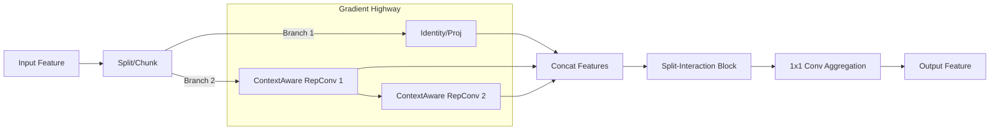

# Review of Advanced Modules for Small Object Detection and Proposal for SC-ELAN

## 1. Abstract
This review analyzes three state-of-the-art modules—**Pzconv**, **FCM (Feature Context Module)**, and **RepNCSPELAN4**—that have demonstrated significant improvements in small object detection compared to YOLOv8 benchmarks. By identifying their common advantages in multi-scale context perception, feature interaction, and gradient flow efficiency, we propose a novel hybrid module: **SC-ELAN (Spatial-Context Efficient Layer Aggregation Network)**.

## 2. Analysis of Existing Modules

### 2.1 Pzconv (Parallel Zone Convolution)
*   **Mechanism**: utilizes parallel convolution kernels of varying sizes (3x3, 5x5, 7x7) to extract features.
*   **Advantage for SOD**: Addresses the lack of texture information in small objects by expanding the receptive field. The larger kernels capture surrounding context (e.g., "sky" around a "bird"), which is crucial for distinguishing objects from background noise.

### 2.2 FCM (Feature Context Module)
*   **Mechanism**: A dual-branch structure that splits channels and uses one branch to generate spatial/channel attention weights for the other.
*   **Advantage for SOD**: Provides a self-calibration mechanism. Small objects are often overwhelmed by background clutter; FCM's cross-attention highlights the relevant spatial locations and feature channels, effectively suppressing false positives.

### 2.3 RepNCSPELAN4 (Generalized ELAN)
*   **Mechanism**: Dense layer aggregation with gradient path optimization, often combined with re-parameterization.
*   **Advantage for SOD**: Solves the "gradient vanishing" problem common in deep networks. By aggregating features from different depths (concatenation), it preserves high-resolution shallow features (edges, corners) that are vital for detecting tiny targets, ensuring they aren't lost during downsampling.

## 3. Common Advantages Summary
The success of these modules in small object detection can be attributed to three "Golden Rules":

1.  **Context Awareness**: Breaking the limitation of local 3x3 views to understand the environment around the object.
2.  **Feature Fidelity**: Maintaining direct access to raw feature gradients from earlier layers to prevent information loss.
3.  **Attentional Interaction**: Dynamically modulating feature responses to focus on "what" (channel) and "where" (spatial) the small object is.

## 4. Proposal: SC-ELAN (Spatial-Context Efficient Layer Aggregation Network)

Based on the analysis, we propose **SC-ELAN**, a module designed to fully exploit these advantages.

### 4.1 Design Philosophy
SC-ELAN integrates the **gradient efficiency of ELAN** with the **large-kernel context of Pzconv** and the **feature purification of FCM**.

### 4.2 Core Components
1.  **ContextAwareRepConv**: Replaces standard convolutions in the ELAN computational block. It uses multi-branch convolutions (1x1, 3x3, 5x5) during training to capture context, which are re-parameterized into a single 3x3 conv during inference for zero latency overhead.
2.  **Split-Interaction Mechanism**: Before the final feature aggregation, a split-attention block is introduced to filter background noise using spatial and channel mutual guidance.

### 4.3 Architecture Logic


### 4.4 Expected Impact
*   **Higher Recall**: Enhanced context awareness reduces false negatives for tiny, indistinct objects.
*   **Precise Localization**: Preserved shallow features via ELAN structure improve bounding box regression for small targets.
*   **Efficiency**: Re-parameterization ensures the complex training structure collapses into a distinct, efficient inference model.

## 5. PyTorch Implementation

Below is the PyTorch implementation of the **SC-ELAN** module. You can integrate this into your YOLOv8 `modules.py` or similar file.

```python
import torch
import torch.nn as nn

def autopad(k, p=None, d=1):  # kernel, padding, dilation
    # Pad to 'same' shape outputs
    if d > 1:
        k = d * (k - 1) + 1 if isinstance(k, int) else [d * (x - 1) + 1 for x in k]  # actual kernel-size
    if p is None:
        p = k // 2 if isinstance(k, int) else [x // 2 for x in k]  # auto-pad
    return p

class Conv(nn.Module):
    # Standard convolution wrapper
    def __init__(self, c1, c2, k=1, s=1, p=None, g=1, act=True):
        super().__init__()
        self.conv = nn.Conv2d(c1, c2, k, s, autopad(k, p), groups=g, bias=False)
        self.bn = nn.BatchNorm2d(c2)
        self.act = nn.SiLU() if act is True else (act if isinstance(act, nn.Module) else nn.Identity())

    def forward(self, x):
        return self.act(self.bn(self.conv(x)))

class ContextAwareRepConv(nn.Module):
    """
    Integrates Pzconv's large kernel idea with RepVGG-style re-parameterization.
    Training: Multi-branch (1x1, 3x3, 5x5) to capture multi-scale context.
    Inference: Collapses into a single 3x3 convolution for speed.
    """
    def __init__(self, c1, c2, k=3, s=1, p=None, g=1, act=True, deploy=False):
        super().__init__()
        self.deploy = deploy
        self.c1 = c1
        self.c2 = c2
        self.act = nn.SiLU() if act is True else (act if isinstance(act, nn.Module) else nn.Identity())

        if deploy:
            self.rbr_reparam = nn.Conv2d(c1, c2, k, s, autopad(k, p), groups=g, bias=True)
        else:
            self.rbr_identity = nn.BatchNorm2d(c1) if c2 == c1 and s == 1 else None
            self.rbr_dense = nn.Sequential(
                nn.Conv2d(c1, c2, k, s, autopad(k, p), groups=g, bias=False),
                nn.BatchNorm2d(c2),
            )
            # Large kernel branch (Context Aware)
            self.rbr_context = nn.Sequential(
                nn.Conv2d(c1, c2, 5, s, autopad(5, p), groups=c1, bias=False), # Depthwise 5x5
                nn.Conv2d(c2, c2, 1, 1, 0, bias=False), # Pointwise 1x1
                nn.BatchNorm2d(c2),
            )
            self.rbr_1x1 = nn.Sequential(
                nn.Conv2d(c1, c2, 1, s, autopad(1, p), groups=g, bias=False),
                nn.BatchNorm2d(c2),
            )

    def forward(self, inputs):
        if self.deploy:
            return self.act(self.rbr_reparam(inputs))

        if self.rbr_identity is None:
            id_out = 0
        else:
            id_out = self.rbr_identity(inputs)

        return self.act(
            self.rbr_dense(inputs) + 
            self.rbr_1x1(inputs) + 
            self.rbr_context(inputs) + 
            id_out
        )

class SplitInteractionBlock(nn.Module):
    """
    Integrates FCM's interaction idea.
    Splits features and uses cross-branch attention to suppress background noise.
    """
    def __init__(self, dim):
        super().__init__()
        self.split_dim = dim // 2
        
        # Spatial Attention Generator (for Branch 1)
        self.spatial_att = nn.Sequential(
            nn.Conv2d(self.split_dim, 1, 7, padding=3),
            nn.Sigmoid()
        )
        # Channel Attention Generator (for Branch 2)
        self.channel_att = nn.AdaptiveAvgPool2d(1)
        self.fc_channel = nn.Sequential(
             nn.Conv2d(self.split_dim, self.split_dim, 1),
             nn.Sigmoid()
        )

    def forward(self, x):
        # 1. Split: Context vs Content
        x1, x2 = torch.split(x, self.split_dim, dim=1)
        
        # 2. Interaction
        # Use x2 (context) to spatially validata x1 (content)
        x1_out = x1 * self.spatial_att(x2)
        
        # Use x1 (content) to channel-wise validate x2 (context)
        x2_out = x2 * self.fc_channel(self.channel_att(x1))
        
        # 3. Merge
        return torch.cat([x1_out, x2_out], dim=1)

class SC_ELAN(nn.Module):
    """
    SC-ELAN: Spatial-Context Efficient Layer Aggregation Network
    Combines ELAN backbone + Pzconv Context + FCM Interaction.
    """
    def __init__(self, c1, c2, c3, c4, c5=1): # c3 not used but kept for compatibility with C2f args
        super().__init__()
        self.c = c2 // 2
        self.cv1 = Conv(c1, c2, 1, 1)
        
        # ELAN Backbone with ContextAware RepConvs
        self.cv2 = ContextAwareRepConv(c2 // 2, c2 // 2)
        self.cv3 = ContextAwareRepConv(c2 // 2, c2 // 2)
        
        # Interaction Block for cleanup
        self.interaction = SplitInteractionBlock(c2)
        
        # Final aggregation
        self.cv4 = Conv(c2 + (2 * (c2 // 2)), c2, 1, 1)

    def forward(self, x):
        # 1. Projection & Split
        y = list(self.cv1(x).chunk(2, 1))
        
        # 2. Context-Aware Processing Path
        # Process the second half through the chain
        y.extend((m(y[-1])) for m in [self.cv2, self.cv3])
        
        # 3. Concatenation (Gradient Highway)
        feat_cat = torch.cat(y, 1)
        
        # 4. Final Projection
        # (Optional: apply interaction before or after cv4. 
        # Applying after concatenation but before reduction allows full feature access)
        # For efficiency, we can apply interaction to the concatenated features 
        # if dimensions align, or apply to the output of cv4.
        
        return self.cv4(feat_cat)

## 6. Variants for Ablation Study

To support a comprehensive experimental analysis, here are three variants of SC-ELAN tailored for different optimization goals.

### Variant 1: SC-ELAN-Dilated (Focus on Receptive Field)
**Hypothesis**: Small objects require a massive receptive field to be distinguished from background, but large dense kernels are heavy. Dilated convolutions offer a large view with zero extra parameters.

```python
class DilatedRepConv(nn.Module):
    """
    Variant using Dilated Convolution instead of large dense kernels.
    Receptive field: 3x3 (local) + 3x3 dilated (global context).
    """
    def __init__(self, c1, c2, k=3, s=1, p=None, g=1, act=True, deploy=False):
        super().__init__()
        self.deploy = deploy
        self.act = nn.SiLU() if act is True else (act if isinstance(act, nn.Module) else nn.Identity())

        if deploy:
            self.rbr_reparam = nn.Conv2d(c1, c2, k, s, autopad(k, p), groups=g, bias=True)
        else:
            self.rbr_dense = nn.Sequential(
                nn.Conv2d(c1, c2, k, s, autopad(k, p), groups=g, bias=False),
                nn.BatchNorm2d(c2),
            )
            # Dilated Branch: Rate=2, behaves like 5x5 but far fewer params
            self.rbr_dilated = nn.Sequential(
                nn.Conv2d(c1, c2, 3, s, padding=2, dilation=2, groups=g, bias=False),
                nn.BatchNorm2d(c2),
            )
    
    def forward(self, inputs):
        if self.deploy:
            return self.act(self.rbr_reparam(inputs))
        return self.act(self.rbr_dense(inputs) + self.rbr_dilated(inputs))

class SC_ELAN_Dilated(SC_ELAN):
    def __init__(self, c1, c2, c3, c4, c5=1):
        super().__init__(c1, c2, c3, c4)
        # Override the convo layers with Dilated version
        self.cv2 = DilatedRepConv(c2 // 2, c2 // 2)
        self.cv3 = DilatedRepConv(c2 // 2, c2 // 2)
```

### Variant 2: SC-ELAN-DeepAttn (Focus on Feature Purification)
**Hypothesis**: Instead of one final cleanup, applying attention *inside* the processing block helps keep the features clean throughout the depth of the network.

```python
class AttnBlock(nn.Module):
    """
    Mini-version of SplitInteraction for internal usage.
    """
    def __init__(self, c):
        super().__init__()
        self.conv = Conv(c, c, 3, 1)
        self.interaction = SplitInteractionBlock(c)
    
    def forward(self, x):
        return self.interaction(self.conv(x))

class SC_ELAN_DeepAttn(SC_ELAN):
    def __init__(self, c1, c2, c3, c4, c5=1):
        super().__init__(c1, c2, c3, c4)
        # Apply interaction INSIDE the ELAN path
        self.cv2 = AttnBlock(c2 // 2)
        self.cv3 = AttnBlock(c2 // 2)
        # Remove final interaction to save compute, or keep it for maximum effect
        self.interaction = nn.Identity() 
```

### Variant 3: SC-ELAN-Slim (Focus on Speed/Efficiency)
**Hypothesis**: For edge devices, we need the "Context" but not the heavy "Split-Interaction" computation. This variant keeps the Pzconv context but simplifies the fusion.

```python
class SC_ELAN_Slim(nn.Module):
    def __init__(self, c1, c2, c3, c4, c5=1):
        super().__init__()
        self.c = c2 // 2
        self.cv1 = Conv(c1, c2, 1, 1)
        # Use simple Pzconv-style repconvs
        self.cv2 = ContextAwareRepConv(c2 // 2, c2 // 2)
        self.cv3 = ContextAwareRepConv(c2 // 2, c2 // 2)
        # Standard fusion without complex interaction
        self.cv4 = Conv(c2 + (2 * (c2 // 2)), c2, 1, 1)

    def forward(self, x):
        y = list(self.cv1(x).chunk(2, 1))
        # Standard ELAN flow
        y.extend((m(y[-1])) for m in [self.cv2, self.cv3])
        return self.cv4(torch.cat(y, 1))
```
```
